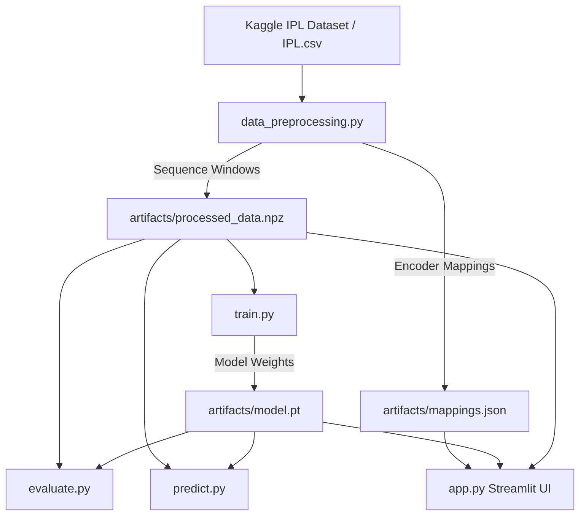

# 🏏 Cricket Score & Win Probability Prediction with LSTM


A state-of-the-art Deep Learning pipeline for predicting Indian Premier League (IPL) **2nd Innings Win Probability** using Long Short-Term Memory (LSTM) recurrent neural networks, trained on complete IPL ball-by-ball match data (2008 – 2024/2025).

---

## 📊 Statistical Overview & Empirical Performance

### 📈 Full Dataset Statistics (`IPL.csv` 2008–2025)

| Metric | Empirical Value | Description |
| :--- | :---: | :--- |
| **Total Ball-by-Ball Records** | **278,205** | Complete delivery records across all seasons |
| **Total Matches** | **1,169** | Unique match IDs processed |
| **Sequence Length** | **20** | Sliding ball-by-ball window per sample |
| **Training Sequences (`X_train`)** | **89,511** | 80% train split sequence tensor shape `(89511, 20, 8)` |
| **Testing Sequences (`X_test`)** | **22,302** | 20% test split sequence tensor shape `(22302, 20, 8)` |
| **Unique Players Encoded** | **767** | Batters & bowlers mapped to integer IDs |
| **Unique Teams Encoded** | **19** | Franchise teams mapped |
| **Unique Venues Encoded** | **59** | Stadiums & grounds mapped |
| **Max Target Score** | **288** | Highest target score in dataset |

---

### 🎯 Full Dataset Model Evaluation Metrics

| Metric | Score | Detail |
| :--- | :---: | :--- |
| **Test Accuracy** | **75.60%** | Overall correct win/loss predictions on 22,302 test samples |
| **ROC-AUC Score** | **0.8378** | High discriminative capability across confidence thresholds |
| **Precision** | **0.6933** | Positive predictive accuracy |
| **Recall** | **0.8647** | Sensitivity to winning chase conditions |
| **F1 Score** | **0.7696** | Balanced metric across precision & recall |
| **Test Loss** | **0.5993** | Binary Cross-Entropy Loss |

---

## 🌟 Features

- **LSTM Sequence Modeling**: Captures ball-by-ball dynamic match trends over 20-ball sequence windows.
- **Kaggle IPL Dataset Integration**: Supports direct Kaggle downloading (`chaitu20/ipl-dataset2008-2025`) or local CSV ingestion.
- **Automated Data Processing**: Normalizes numeric match situation features and serializes team/player encodings.
- **Interactive Streamlit Web Dashboard**: Real-time match scenario simulator, 20-ball win probability trajectory graphs, and model metrics inspector.
- **Evaluation Suite**: Calculates Accuracy, ROC-AUC score, Loss, Precision, Recall, and F1 Score.
- **Cross-Platform & GPU Acceleration**: Supports CUDA, Apple MPS, and CPU backends.

---

## 🏗️ System Architecture



---

## 📂 Repository Structure

```text
.
├── IPL.csv                  # Kaggle IPL ball-by-ball dataset (2008–2025)
├── data_preprocessing.py    # Feature engineering, sliding-window sequence creation, mapping serialization
├── model.py                 # PyTorch LSTMWinPredictor architecture definition
├── train.py                 # Model training loop with validation & checkpointing
├── evaluate.py              # Test dataset metrics & evaluation report
├── predict.py               # Interactive CLI sample predictor with visual confidence bar
├── app.py                   # Streamlit web application (Match Simulator & Trajectory Plotter)
├── requirements.txt         # Project dependencies
├── .gitignore               # Git ignore configuration
└── README.md                # Project documentation
```

---

## 🚀 Quickstart Guide

### 1. Clone & Install Dependencies

```bash
git clone https://github.com/monal071/score-prediction.git
cd score-prediction
pip install -r requirements.txt
```

### 2. Preprocess Data

Place your downloaded Kaggle dataset as `IPL.csv` in the root folder, or download directly from Kaggle:

#### Option A: Local CSV (Default)
```bash
python data_preprocessing.py
```

#### Option B: Download Directly from Kaggle (`chaitu20/ipl-dataset2008-2025`)
```bash
pip install kagglehub
python data_preprocessing.py --kaggle chaitu20/ipl-dataset2008-2025
```

### 3. Train the LSTM Model

Trains the PyTorch model for 15 epochs and exports `artifacts/model.pt`:

```bash
python train.py
```

### 4. Evaluate Model Performance

Computes test accuracy, ROC-AUC score, precision, recall, and F1 score:

```bash
python evaluate.py
```

### 5. Run Single Sample Inference (CLI)

Predict win probability for a specific sample from the test set:

```bash
python predict.py --sample 0
```

---

## 💻 Launch Interactive Streamlit Dashboard

Run the interactive web app to simulate live match situations and plot win probability trajectories:

```bash
streamlit run app.py
```

Features in the Streamlit app:
- 🎯 **Match Scenario Simulator**: Adjust batting team, target runs, current score, balls bowled, and wickets lost to compute live win probability.
- 📊 **Test Dataset Trajectory**: Plot how win probability evolved ball-by-ball over any 20-ball sequence window in the test set.
- 📈 **Model Performance & Info**: View loss curves, ROC-AUC score, and neural network parameter summaries.

---

## 📊 Model Specifications

| Property | Description |
| :--- | :--- |
| **Model Type** | Recurrent Neural Network (LSTM) |
| **Sequence Length** | 20 consecutive balls |
| **Input Features (8)** | `batting_team`, `bowling_team`, `venue`, `batter`, `bowler`, `runs_left`, `team_balls`, `team_wicket` |
| **Hidden Dimensions** | 64 LSTM units |
| **Optimizer** | Adam (`lr=0.001`) |
| **Loss Function** | Binary Cross Entropy (`BCELoss`) |

---

## 📜 License

Distributed under the MIT License. See `LICENSE` for more details.
