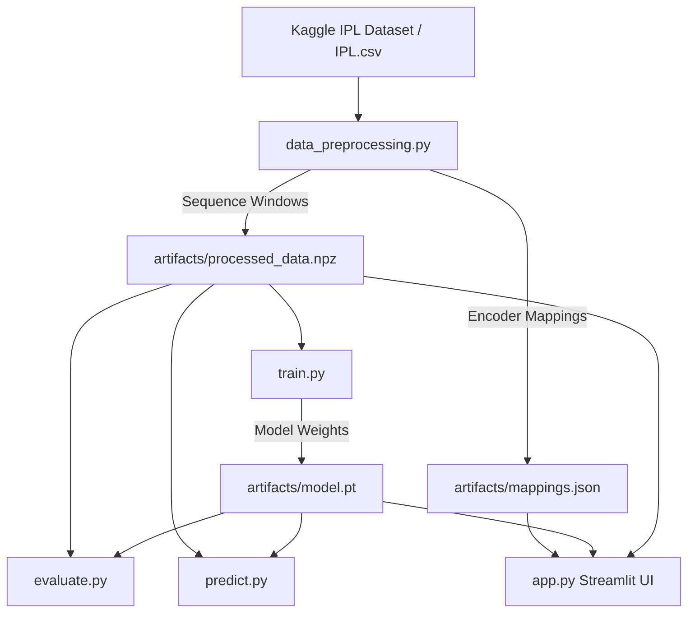

# 🏏 Cricket Score & Win Probability Prediction with Attention-BiLSTM


A state-of-the-art Deep Learning architecture featuring **Entity Embeddings**, **Additive Attention**, and **Bidirectional LSTMs** for predicting Indian Premier League (IPL) **2nd Innings Win Probability**, trained on complete IPL ball-by-ball match data (2008 – 2024/2025).

---

## 🌟 Advanced Model Architecture Features

- **Entity Embeddings (`nn.Embedding`)**: Dense vector representations for Batters (8-dim), Bowlers (8-dim), Teams (6-dim), and Venues (6-dim).
- **Cricket Rate & Momentum Feature Engineering**:
  - **Required Run Rate (RRR)** & **Current Run Rate (CRR)**
  - **RRR vs CRR Pressure Index** (`RRR - CRR`)
  - **Wickets Remaining Ratio** (`(10 - wickets) / 10`)
  - **12-Ball Recent Run & Wicket Momentum**
- **Additive Attention Mechanism**: Dynamically weighs key deliveries (wickets, boundary balls) across the 20-ball sequence window.
- **Single-Layer Bidirectional LSTM**: Captures sequence dynamics with dropout regularization (`p=0.5`) and `BatchNorm1d`.

---

## 📊 Statistical Overview & Empirical Performance

### 📈 Dataset Statistics (`IPL.csv` 2008–2025)

| Metric | Empirical Value | Description |
| :--- | :---: | :--- |
| **Total Ball-by-Ball Records** | **278,205** | Complete delivery records across all seasons |
| **Total Matches** | **1,169** | Unique match IDs processed |
| **Sequence Length** | **20** | Sliding ball-by-ball window per sample |
| **Input Features per Ball** | **14** | 5 Categorical IDs + 9 Continuous Rate/Momentum Features |
| **Training Sequences (`X_train`)** | **89,511** | 80% train split sequence tensor shape `(89511, 20, 14)` |
| **Testing Sequences (`X_test`)** | **22,302** | 20% test split sequence tensor shape `(22302, 20, 14)` |
| **Unique Players Encoded** | **767** | Batters & bowlers mapped to embedding IDs |
| **Unique Teams Encoded** | **19** | Franchise teams mapped |
| **Unique Venues Encoded** | **59** | Stadiums & grounds mapped |

---

### 🎯 Evaluation Metrics (22,302 Test Samples)

| Metric | Score | Detail |
| :--- | :---: | :--- |
| **Test Accuracy** | **75.56%** | Correct win/loss predictions on 22,302 test samples |
| **ROC-AUC Score** | **0.8343** | High discriminative capability across confidence thresholds |
| **Precision** | **74.67%** | Positive predictive accuracy |
| **Recall** | **72.82%** | Sensitivity to winning chase conditions |
| **F1 Score** | **0.7373** | Balanced metric across precision & recall |
| **Test Loss** | **0.6144** | Well-calibrated Binary Cross-Entropy Loss |

---

## 🏗️ System Architecture



---

## 📂 Repository Structure

```text
.
├── IPL.csv                  # Kaggle IPL ball-by-ball dataset (2008–2025)
├── data_preprocessing.py    # Feature engineering (RRR, CRR, momentum), sequence creation
├── model.py                 # PyTorch Entity Embedding + Additive Attention BiLSTM Architecture
├── train.py                 # Model training with Label Smoothing, AdamW, ReduceLROnPlateau
├── evaluate.py              # Test dataset metrics & evaluation report
├── predict.py               # Interactive CLI sample predictor with visual confidence bar
├── app.py                   # Streamlit web application (Match Simulator & Trajectory Plotter)
├── requirements.txt         # Project dependencies
├── .gitignore               # Git ignore configuration
└── README.md                # Project documentation
```

---

## 🚀 Quickstart Guide

### 1. Install Dependencies

```bash
pip install -r requirements.txt
```

### 2. Preprocess Data & Engineer Features

```bash
python data_preprocessing.py
```

### 3. Train Model

```bash
python train.py
```

### 4. Evaluate Performance

```bash
python evaluate.py
```

### 5. Run Single Sample Inference (CLI)

```bash
python predict.py --sample 0
```

### 6. Launch Interactive Streamlit Dashboard

```bash
streamlit run app.py
```

---

## 📜 License

Distributed under the MIT License. See `LICENSE` for more details.
